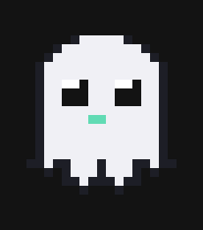

<!-- markdownlint-disable MD033 MD041 -->

  

  
  
  
  
  

<h1 align="center">👻 Ghost</h1>

  <strong>Um assistente de IA que <ins>some</ins> quando você compartilha a tela.</strong> 
  Lê a sua tela, transcreve reuniões, responde em tempo real — e ninguém do outro lado vê que ele existe.

---

## 📥 Baixar agora

<table align="center">
<tr>
<td align="center" width="420">
  
   Windows 10 / 11 · 89 MB · sem UAC / sem admin
</td>
<td align="center" width="420">
  
   Port em desenvolvimento · <a href="https://github.com/userJesus/ghost/issues">acompanhe aqui</a>
</td>
</tr>
</table>

  
    🔎 Ver todos os arquivos e somas SHA256 →
    <a href="https://github.com/userJesus/ghost/releases/latest">github.com/userJesus/ghost/releases/latest</a>
  

---

## ✨ O que o Ghost faz

<table>
<tr>
<td width="50%" valign="top">

### 🫥 Invisível em screen-share
Liga a flag `WDA_EXCLUDEFROMCAPTURE` do Windows — Zoom, Teams, Meet, OBS e Loom simplesmente **não enxergam** a janela do Ghost, nem durante gravação.

</td>
<td width="50%" valign="top">

### 👁️ Lê sua tela
Captura a tela inteira, uma janela ou uma região. A IA "olha" o print e responde sobre código, erros, documentos, planilhas — o que estiver ali.

</td>
</tr>
<tr>
<td width="50%" valign="top">

### 🎙️ Transcreve reuniões
Captura mic + áudio do sistema ao mesmo tempo (Stereo Mix / WASAPI loopback no Windows) e gera transcrições contínuas em background.

</td>
<td width="50%" valign="top">

### 🧠 Conversas com contexto
Titulagem dinâmica gerada pela IA. **Branch** resume a conversa atual antes de abrir outra — você nunca perde o fio da meada.

</td>
</tr>
<tr>
<td width="50%" valign="top">

### 🎧 Agente de voz em tempo real <code>BETA</code>
Conversa por voz ao vivo via OpenAI Realtime (WebRTC). O agente **executa ações no Ghost sozinho** — capturar tela, minimizar, vigiar, ler clipboard, abrir URL — com function calling roteado para os mesmos botões que você clica.

</td>
<td width="50%" valign="top">

### ⚡ WebRTC com ephemeral tokens
O áudio trafega direto do Ghost pra OpenAI via WebRTC; sua chave da OpenAI **nunca** sai do Python. O browser recebe só um token de ~60s usado pra abrir o peer connection.

</td>
</tr>
<tr>
<td width="50%" valign="top">

### 🔄 Atualizações automáticas
Toda vez que abre, o Ghost consulta a API de releases do GitHub. Quando sai uma versão nova, um banner verde aparece com um botão **Baixar** — você decide quando atualizar.

</td>
<td width="50%" valign="top">

### 🔒 100% local
Logs, histórico, configurações e sua chave da OpenAI nunca saem da sua máquina. Ficam em `~/.ghost` e só a mensagem que você envia para a IA é que trafega (direto para os servidores da OpenAI, não pelos meus).

</td>
</tr>
</table>

---

## 🚀 Primeiros passos

### 1️⃣ Instale

<strong>🪟 Windows</strong> — clique para expandir

1. [**Baixe o instalador**](https://github.com/userJesus/ghost/releases/latest/download/GhostSetup.exe) (89 MB)
2. Execute o instalador `.exe`.
   > ⚠️ Se aparecer a tela azul **"O Windows protegeu o computador"** (SmartScreen), é porque o Ghost ainda não é assinado com certificado Authenticode. Clique em **"Mais informações"** → botão **"Executar assim mesmo"**. Detalhes e causa [logo abaixo](#%EF%B8%8F-aviso-do-smartscreen-fornecedor-desconhecido).
3. O instalador coloca o Ghost em `%LocalAppData%\Programs\Ghost` (sem precisar de admin).
4. Marque (opcional):
   - ✅ Atalho na área de trabalho
   - ✅ Iniciar com o Windows
5. Finalizar → Ghost abre sozinho
6. Na primeira tela, cole sua **chave da OpenAI** (`sk-...`)

##### 🛡️ Aviso do SmartScreen ("Fornecedor desconhecido")

Windows SmartScreen bloqueia qualquer `.exe` não assinado com um certificado Authenticode, de forma análoga ao Gatekeeper no macOS. Certificado Authenticode é pago (~US$ 200/ano; EV ~US$ 300/ano) e o Ghost é distribuído gratuitamente sob licença não-comercial, então assinatura oficial não está nos planos imediatos.

O instalador é **auditável** — código-fonte completo neste repositório, `SHA256SUMS.txt` no release e possibilidade de reconstruir localmente via `scripts\build_windows.bat`.

**Como autorizar:**
1. Na tela azul, clique em **"Mais informações"** (texto em cima, à esquerda)
2. Aparece uma linha adicional com o nome do fornecedor ("Desconhecido") e um botão **"Executar assim mesmo"**
3. Clique no botão → o instalador roda normalmente

O SmartScreen lembra dessa autorização — na próxima vez que você abrir o mesmo arquivo, passa direto.

<strong>🍏 macOS</strong> — em breve

O port para macOS está em desenvolvimento. Acompanhe o progresso nas
[issues](https://github.com/userJesus/ghost/issues) ou observe a aba
[Releases](https://github.com/userJesus/ghost/releases) para quando
o primeiro `.dmg` for publicado.

### 2️⃣ Atalhos

<table align="center">
<tr><th>Atalho</th><th>O que faz</th></tr>
<tr><td><kbd>Ctrl</kbd>+<kbd>Shift</kbd>+<kbd>G</kbd></td><td>Abre / foca o Ghost de qualquer lugar</td></tr>
<tr><td>Botão <strong>→</strong> do app</td><td>"Encolher para o canto" — vira um ícone 56×56 na borda da tela</td></tr>
<tr><td>Click no ícone docked</td><td>Restaura o app inteiro</td></tr>
</table>

---

## 🎨 Identidade visual

<table>
<tr>
<td align="center" width="230">
  
   <strong>Ghost</strong> 
  fantasminha pixel-art do empty-state
</td>
<td valign="middle">

A identidade visual nasceu do próprio modo docked — um ícone verde-menta que fica parado na borda da tela esperando você chamar. A cor principal puxa para "esmeralda líquida" (`#61DBB4` → `#3CB895`) sobre um fundo Mica escuro do Windows 11.

<table>
<tr>
<td align="center"></td>
<td align="center"></td>
<td align="center"></td>
<td align="center"></td>
</tr>
<tr>
<td align="center"><code>#61DBB4</code> accent-1</td>
<td align="center"><code>#3CB895</code> accent-2</td>
<td align="center"><code>#00281E</code> on-accent</td>
<td align="center"><code>#131313</code> mica-base</td>
</tr>
</table>

</td>
</tr>
</table>

---

## 🗑️ Desinstalar (seus dados ficam seguros)

| SO       | Como desinstalar                                  | Onde ficam seus dados    |
|----------|---------------------------------------------------|--------------------------|
| 🪟 Windows | **Configurações → Apps** → Ghost → Desinstalar     | `C:\Users\<você>\.ghost` |

O desinstalador **pergunta se você quer apagar os dados** (logs, configurações, histórico, chave da OpenAI) ou **mantê-los**. Se reinstalar depois mantendo os dados, seu histórico volta como se nada tivesse acontecido.

---

## ⚖️ Licença

O Ghost é distribuído sob a **Non-Commercial Source-Available License (NCSAL) v1.0** — código aberto para ler, estudar, modificar e contribuir. Só não pode ser **usado comercialmente**.

<table>
<tr>
<th>✅ Permitido</th>
<th>❌ Proibido sem licença comercial</th>
</tr>
<tr>
<td>

- Uso pessoal, educacional, pesquisa
- Estudar e modificar o código
- Contribuir com PRs ao projeto
- Compartilhar sem cobrar

</td>
<td>

- Venda, SaaS, consultoria paga
- Incorporar em produto pago
- Anúncio / assinatura / paywall
- Operação interna de empresa com fim lucrativo

</td>
</tr>
</table>

**Fundamento legal (Brasil):** Lei nº 9.609/98 (Lei do Software), Lei nº 9.610/98 (Direitos Autorais) e Art. 184 do Código Penal (reclusão de 2 a 4 anos + multa por violação comercial).

Para licenciamento comercial, fale com o autor ↓

---

## 🤝 Contribuir

Pull requests bem-vindas, contanto que respeitem a licença não-comercial.
Veja [CONTRIBUTING.md](CONTRIBUTING.md) e [CODE_OF_CONDUCT.md](CODE_OF_CONDUCT.md).

Build local a partir do código-fonte: [`scripts/build_windows.bat`](scripts/build_windows.bat) (macOS em breve). A versão é lida de [`src/version.py`](src/version.py) — única fonte de verdade para o instalador.

---

## 👤 Autor

<table>
<tr>
<td valign="top">

**Jesus Oliveira**

</td>
</tr>
</table>

---

  
    Copyright © 2026 Jesus Oliveira.
    Source-available under NCSAL v1.0.
    Proibido o uso comercial sem licença separada.
    Ver <a href="LICENSE">LICENSE</a> para detalhes.
  

